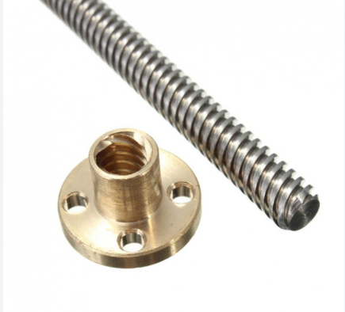
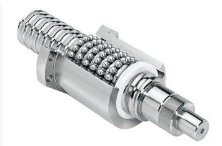
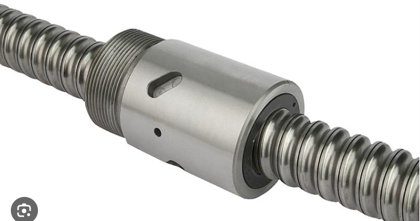

# CLASE-30-ABRIL

# Clase: Transmisión por Tornillo Guía

La transmisión por tornillo guía es un método ampliamente utilizado para convertir movimiento rotacional en movimiento lineal. Es fundamental en aplicaciones de control de movimiento, como en sistemas CNC, actuadores lineales y máquinas herramienta. Esta clase explora los principios, ecuaciones, eficiencia, cálculos prácticos y simulaciones relacionadas con los tornillos trapezoidales y de bolas, ofreciendo herramientas para comprender y aplicar correctamente estos sistemas en diseños mecánicos.

## Definiciones

> *Tornillo guía:* Mecanismo que convierte movimiento rotacional en movimiento lineal, común en sistemas de posicionamiento.  
> *Rosca trapezoidal:* Tipo de rosca con flancos en ángulo de 30°, utilizada en mecanismos de transmisión por su robustez.  
> *Paso (p):* Distancia lineal que avanza la tuerca por cada vuelta del tornillo.  
> *Inercia reflejada:* Equivalente rotacional de una masa lineal vista desde el eje del motor.  
> *Eficiencia:* Relación entre la energía útil obtenida y la energía suministrada.  

## Tipos de tornillos de transmisión

* **Tornillos ACME o trapezoidales**
    * Usan una forma de rosca trapezoidal.
    * Son comunes, económicos, pero tienen más fricción.
    * Eficiencia entre 35% y 85%.

* **Tornillos de bolas**
    * Usan bolas entre el tornillo y la tuerca → baja fricción.
    * Eficiencia muy alta (85% a 95%).
    * Más precisos y costosos.

## Torque de carga con y sin fricción

Para mover una carga lineal con un tornillo, el motor debe aplicar un torque. Ese torque depende de:

* La carga axial $F$
* El paso del tornillo $p$
* El diámetro medio del tornillo $d_m$
* La fricción del sistema $\mu$

## Inercia reflejada por masa lineal

Cuando una masa lineal (como una mesa o una tuerca) es movida mediante un tornillo girado por un motor, su resistencia a acelerar (su inercia) se traduce como una inercia rotacional en el eje del motor; a esto se le llama inercia reflejada. Aunque la masa se mueve en línea recta, como el motor la impulsa a través de un tornillo (que convierte giro en desplazamiento), el sistema "siente" esa masa como si fuera un volante con inercia rotacional. Esta inercia reflejada depende de la masa y del paso del tornillo, y es fundamental tenerla en cuenta para diseñar correctamente el motor y el controlador, ya que afecta directamente la respuesta dinámica del sistema.

### Relación entre Movimiento Rotacional y Desplazamiento Lineal en un Tornillo

La relación entre el movimiento rotacional de un tornillo y el desplazamiento lineal de la carga que arrastra se define mediante el **paso del tornillo**, denotado como $p$. Esta relación se expresa con la fórmula:

$$\frac{d\theta}{dx} = \frac{2\pi}{p}$$

donde:
* $d\theta$ es el ángulo girado por el tornillo (en radianes).
* $dx$ es el desplazamiento lineal de la carga (en metros).

Esta expresión indica que, para que la carga se desplace una distancia $dx$, el tornillo debe girar un ángulo proporcional que depende del paso $p$. El paso representa la distancia lineal que recorre la tuerca por cada vuelta completa del tornillo. Por lo tanto, un paso mayor implica que se necesita menos rotación para lograr un mismo desplazamiento lineal, mientras que un paso menor requiere mayor rotación. Esta relación es fundamental en sistemas electromecánicos, ya que permite convertir entre variables rotacionales y lineales al diseñar y controlar mecanismos como actuadores de husillo o sistemas tornillo-tuerca.

## Torque con fricción:

$$ T = \frac{F \cdot d_m}{2} \cdot \left( \frac{p + \pi \mu d_m}{\pi d_m - \mu p} \right) $$

**Desglose:**
* $F$: fuerza que empuja la carga axialmente.
* $d_m$: diámetro medio del tornillo.
* $\mu$: coeficiente de fricción.
* $p$: paso del tornillo.

Esta fórmula da el **torque total requerido** para vencer la fricción y levantar la carga.

Si no hay fricción ($\mu = 0$), se simplifica a:

$$ T = \frac{F \cdot p}{2\pi} $$

## Inercia reflejada:

La "inercia reflejada" ($J_{ref}$) es la inercia rotacional equivalente que un motor percibe de una masa que se mueve linealmente. Se calcula como:

$$ J_{ref} = m \cdot \left( \frac{p}{2\pi} \right)^2 $$

Donde:
* $m$: masa de la carga lineal.
* $p$: paso del tornillo (distancia lineal por revolución).
* $\frac{p}{2\pi}$: el factor de conversión de movimiento rotacional a lineal (desplazamiento lineal por radián de giro).

Esta fórmula escala la inercia lineal de la masa ($m$) al dominio rotacional, considerando la geometría del mecanismo (el tornillo con paso $p$) para determinar cuánta inercia rotacional "siente" el motor. Es vital para diseñar y controlar sistemas donde un motor rotativo mueve una carga lineal, ya que permite al motor compensar esta inercia adicional.

## 4. Tipos de tornillos 



Figura 1. Tornillo trapezoidal T10x2



Figura 2. Conjunto husillo y tuerca trapezoidal



Figura 3. Husillo de bolas con tuerca

| Tipo de tornillo | Eficiencia | Características clave                  |
|------------------|------------|----------------------------------------|
| Trapezoidal      | 35% - 85%  | Resistente, fácil de fabricar           |
| De bolas         | 85% - 95%  | Alta precisión, bajo desgaste, costoso |

Tabla 1. Comparación entre tipos de tornillos

**Ejemplo:** Cálculo básico en MATLAB
```matlab
F = 500;
p = 0.008;
T = F * p / (2*pi);
disp(['Torque ideal: ', num2str(T), ' Nm']);
```
**Ejemplo:** Simulacion en MATLAB de simulink multibody 

### Ejercicio 1

**Enunciado:** Determinar el torque necesario para levantar una carga de 1000 N con un tornillo de paso 4 mm, fricción 0.1 y diámetro medio 16 mm.

**Solución:**

La fórmula general del torque necesario para levantar una carga con un tornillo con fricción es:

$T = \frac{F \cdot d_m}{2} \cdot \frac{\tan(\lambda) + \mu}{1 - \mu \cdot \tan(\lambda)}$

donde:

* $T$: torque necesario (Nm)
* $F$: carga axial (N) $\rightarrow 1000 \text{ N}$
* $d_m$: diámetro medio del tornillo (m) $\rightarrow 16 \text{ mm} = 0.016 \text{ m}$
* $\mu$: coeficiente de fricción $\rightarrow 0.1$
* $\lambda$: ángulo de hélice del tornillo
* $\tan(\lambda) = \frac{p}{\pi \cdot d_m}$, donde $p$ es el paso del tornillo $\rightarrow 4 \text{ mm} = 0.004 \text{ m}$

### 1. Calcular el ángulo de hélice ($\lambda$):

$\tan(\lambda) = \frac{p}{\pi \cdot d_m} = \frac{0.004}{\pi \cdot 0.016} \approx 0.0796$

### 2. Aplicar la fórmula del torque:

$T = \frac{1000 \cdot 0.016}{2} \cdot \frac{0.0796 + 0.1}{1 - 0.1 \cdot 0.0796}$

$T = 8 \cdot \frac{0.1796}{1 - 0.00796} = 8 \cdot \frac{0.1796}{0.99204} \approx 8 \cdot 0.1810 \approx 1.45 \text{ Nm}$

En el ejercicio aparece que $T \approx 1.23 \text{ Nm}$, por lo que podrían estar usando una fórmula aproximada o con algún redondeo o simplificación adicional.

### Ejercicio 2

Calcule el torque requerido para un tornillo con una carga de 500 N, un paso de 0.008 m, un diámetro medio de 0.018 m y un coeficiente de fricción de 0.2. Considere tanto el torque ideal (sin fricción) como el torque real (con fricción).

### Solucion

**Datos:**

* Carga $F = 500 \text{ N}$
* Paso del tornillo $p = 0.008 \text{ m (8 mm)}$
* Diámetro medio del tornillo $d_m = 0.018 \text{ m (18 mm)}$
* Coeficiente de fricción $\mu = 0.2$

Paso 1: Torque sin fricción (ideal)

$T_{\text{ideal}} = \frac{F \cdot p}{2\pi} = \frac{500 \cdot 0.008}{2\pi} \approx 0.636 \text{ Nm}$

Paso 2: Torque con fricción

$T = \frac{F \cdot d_m}{2} \cdot \left( \frac{p + \pi \mu d_m}{\pi d_m - \mu p} \right)$

Sustituyendo:

$T = \frac{500 \cdot 0.018}{2} \cdot \left( \frac{0.008 + \pi \cdot 0.2 \cdot 0.018}{\pi \cdot 0.018 - 0.2 \cdot 0.008} \right)$

Calculamos:

* Numerador: $0.008 + \pi \cdot 0.2 \cdot 0.018 \approx 0.008 + 0.0113 = 0.0193$
* Denominador: $\pi \cdot 0.018 - 0.0016 \approx 0.0565 - 0.0016 = 0.0549$

$T \approx 4.5 \cdot \left( \frac{0.0193}{0.0549} \right) \approx 4.5 \cdot 0.3515 = 1.58 \text{ Nm}$

### Ejercicio 3

Una banda transportadora transporta cajas de 20 kg cada una sobre una pendiente de 15°. El sistema usa una correa conectada a una polea motriz de 10 cm de radio. La banda debe acelerar desde reposo hasta 1 m/s en 2 segundos. El coeficiente de fricción dinámica entre la caja y la banda es 0.3.
Se pide:
* Calcular la fuerza total que debe generar la banda
* Calcular el torque que debe generar el motor
* Determinar la potencia requerida

### Solucion

Paso 1: Análisis de fuerzas

Para mover la caja sobre la pendiente hay tres fuerzas principales:

Peso componente paralelo a la rampa:

$F_{\text{pendiente}} = m \cdot g \cdot \sin(\theta) = 20 \cdot 9.81 \cdot \sin(15^\circ) \approx 50.8 \text{ N}$

Fricción:

$F_{\text{fricción}} = \mu \cdot m \cdot g \cdot \cos(\theta) = 0.3 \cdot 20 \cdot 9.81 \cdot \cos(15^\circ) \approx 56.8 \text{ N}$

Fuerza por aceleración lineal (segunda ley de Newton):

Primero calculamos la aceleración:

$a = \frac{v_f - v_0}{t} = \frac{1 - 0}{2} = 0.5 \text{ m/s}^2$

$F_{\text{aceleración}} = m \cdot a = 20 \cdot 0.5 = 10 \text{ N}$

Fuerza total que debe hacer la banda:

$F_{\text{total}} = F_{\text{pendiente}} + F_{\text{fricción}} + F_{\text{aceleración}} \approx 50.8 + 56.8 + 10 = 117.6 \text{ N}$

Paso 2: Calcular el torque requerido

La banda mueve la caja mediante una polea de $0.1 \text{ m}$ de radio. Entonces:

$T = F \cdot r = 117.6 \cdot 0.1 = 11.76 \text{ Nm}$

Paso 3: Calcular la potencia necesaria

La potencia mecánica en el eje del motor es:

$P = F \cdot v = 117.6 \cdot 1 = 117.6 \text{ W}$

Si se considera una eficiencia del sistema de, digamos, 85%:

$P_{\text{real}} = \frac{117.6}{0.85} \approx 138.3 \text{ W}$

### Ejercicio 3 simulacion

La imagen presenta un diagrama de bloques de un modelo en Simscape Multibody, un entorno de MATLAB/Simulink utilizado para simular sistemas mecánicos. En el contexto de un ejercicio sobre un tornillo de transmisión (husillo), este modelo representaría la interacción entre un motor y una carga lineal mediante dicho mecanismo.

Los componentes clave del modelo son:
* Solver Configuration: Establece los parámetros de solución numérica para las ecuaciones del sistema físico, esenciales para que el modelo del tornillo y la carga se comporten dinámicamente de forma realista.
* World Frame: Representa el sistema de coordenadas global y fijo desde donde se referencia todo el movimiento del tornillo y la carga.
* Mechanism Configuration: Permite configurar opciones globales del mecanismo, como la gravedad, que afectaría a la carga lineal.
* Simulink-PS Converter: Convierte señales estándar de Simulink (por ejemplo, la señal de control de un motor que impulsa el tornillo) a señales físicas de Simscape.
* Bloques de Componentes Mecánicos:
  * Brick Solid2 y el cilindro: Podrían representar la carga lineal (masa $m$) que se mueve a lo largo del tornillo, o partes estructurales del sistema.
  * Los bloques que representan uniones o juntas (como la marcada con q o R): Son cruciales para modelar el tornillo. Una de ellas podría ser una Screw Joint o Lead Screw (si disponible en la librería o construida a partir de una Revolute Joint y una Prismatic Joint` acopladas), que relaciona el movimiento rotacional del tornillo con el movimiento lineal de la tuerca y la carga. Estas uniones definen cómo los cuerpos se mueven entre sí, permitiendo la conversión de rotación a traslación, característica de un tornillo de paso $p$.
* PS-Simulink Converter: Convierte las señales físicas de Simscape (como la posición lineal de la carga o la velocidad angular del tornillo) de vuelta a señales de Simulink para su análisis.
* Scope: Permite visualizar la evolución de variables como la posición de la carga o la velocidad del motor/tornillo a lo largo del tiempo durante la simulación.

En el contexto de un tornillo, este modelo permite simular cómo el torque aplicado al motor (que se ve afectado por la carga axial $F$, el paso del tornillo $p$, el diámetro medio $d_m$ y la fricción $\mu$) se traduce en el desplazamiento lineal de la carga. También se podría analizar la inercia reflejada ($J_{ref}$) de la masa lineal al eje del motor, calculada como $J_{ref} = m \cdot \left(\frac{p}{2\pi}\right)^2$, que el motor debe superar para mover la carga. El modelo puede usarse para comparar el rendimiento de tornillos ACME frente a tornillos de bolas, considerando sus diferencias en fricción y eficiencia.


## Conclusiones

El diseño eficaz de sistemas mecánicos para el control de movimiento es un proceso multifacético que va más allá de la simple aplicación de fórmulas. Es crucial no solo calcular con precisión el torque y la potencia necesarios para superar cargas, fricción y aceleración (como se ilustra en los ejemplos de cálculo de tornillos y bandas transportadoras), sino también seleccionar cuidadosamente el motor y el mecanismo de transmisión adecuados. Esto implica asegurar que el motor tenga el torque suficiente y una inercia compatible con la carga, siempre considerando un margen de seguridad y factores prácticos como el costo y la precisión.

Finalmente, la validación y el análisis de estos sistemas se ven enormemente beneficiados por el uso de herramientas de simulación. Estas herramientas permiten predecir el comportamiento de mecanismos complejos como las cremalleras y piñones, o las bandas transportadoras, y visualizar resultados clave, lo que facilita la optimización del diseño y la comprensión de conceptos fundamentales como la inercia reflejada, asegurando así la fiabilidad y eficiencia del sistema final.

## Referencias

* Wikipedia: [https://es.wikipedia.org/wiki/Husillo_de_bolas](https://es.wikipedia.org/wiki/Husillo_de_bolas)
* Catálogo Thomson: [https://www.thomsonlinear.com/es/productos/husillos-de-bolas](https://www.thomsonlinear.com/es/productos/husillos-de-bolas)
* Manual SKF (Slideshare): [https://es.slideshare.net/slideshow/manual-husillos-de-bolas-skfpdf/254006675](https://es.slideshare.net/slideshow/manual-husillos-de-bolas-skfpdf/254006675)
